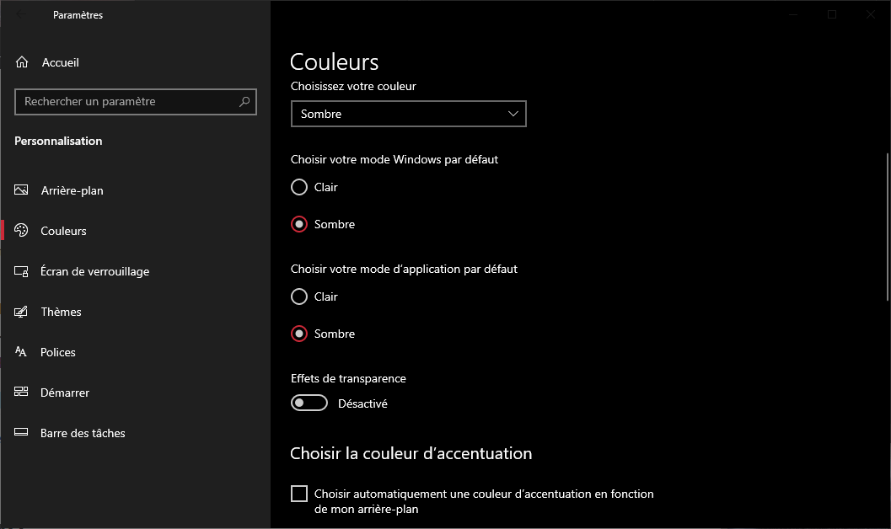

# Animate!
Animate! est un outil qui permet d'animer vos dessins à l'écran à partir d'un fichier image.

Pas de prise de tête avec une interface complexe et des tonnes de fonctionnalités, le but est de vous permettre de visualiser au plus vite vos animations puis d'exporter les images recadrées et sans arrière plan.

L'UI vous permet de choisir chaque zones du dessin puis l'ajoute en fil d'animation. Le cadre est automatiquement ajusté et toutes les modifications du fichier sont détectées vous laissant libre de vous concentrer sur le dessin.

Animate! est compatible avec les fichiers BMP, JPG ou PNG.

La fonction **Export** permet de préparer les sprites avec une taille fixe et sans fond pour importer dans vos projets de développement (ex: Unity).

## Thème UI

Animate implémente les styles Windows 11 Clair/Sombre configurable depuis le panneau de contrôle Windows.

## Licence MIT

Animate! est totalement libre de droits alors n'hésitez pas à l'utiliser !

Vous voulez améliorer le projet ?

​	Contactez-moi par mail à l'adresse suivante : thomas.auguey@hotmail.com
