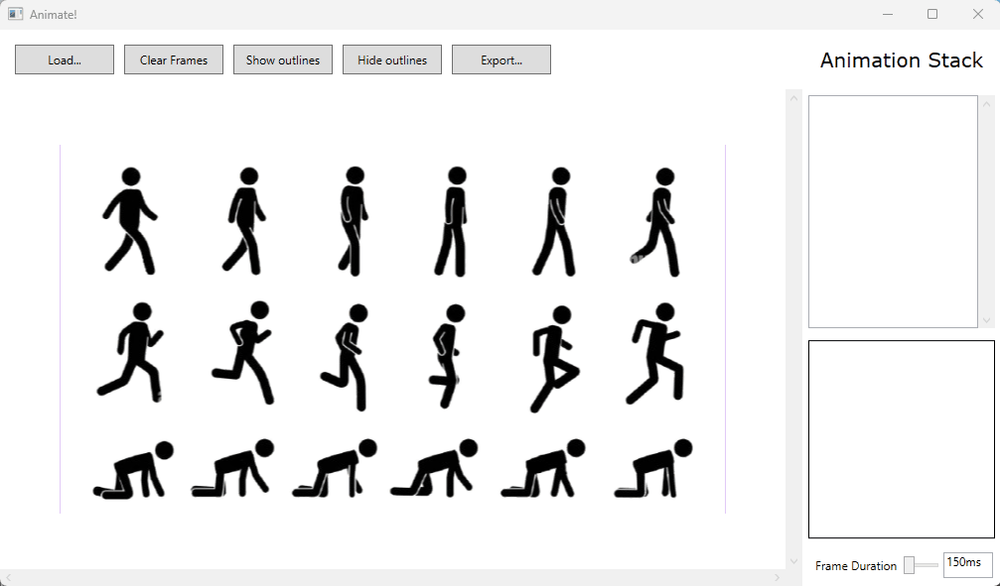
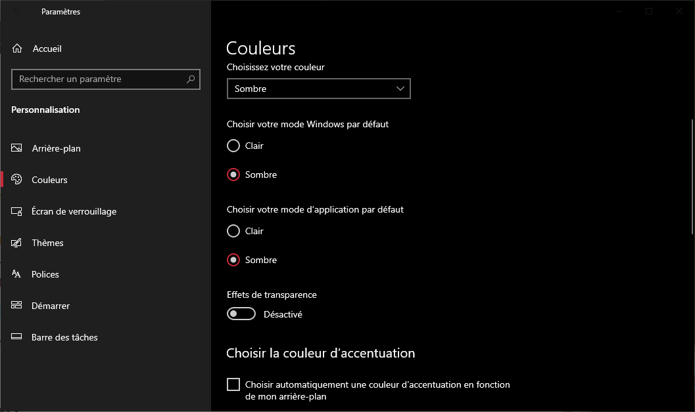

# Animate!
[Read Me (English)](README.md)

Animate! est un outil conçu pour animer facilement des dessins à partir d’un simple fichier image.

L’objectif est de rester **simple et efficace** : pas d’interface complexe ni de fonctionnalités superflues. Animate! permet de visualiser rapidement une animation que vous êtes en train de dessiner, puis d’exporter les images recadrées et débarrassées de leur arrière-plan.

L’interface permet de sélectionner directement les différentes zones du dessin et de les ajouter à la séquence d’animation. Le cadrage est automatiquement ajusté et les modifications que vous apportez au fichier source sont immédiatement répercuté à l'écran sans rechargement manuelle.

**Animate!** prend en charge les formats BMP, JPG et PNG.

La fonction **Export** permet de préparer les sprites pour leur intégration dans un projet de développement, en leur appliquant une taille fixe et en supprimant leur arrière-plan. Les images obtenues peuvent ainsi être directement utilisées dans des environnements tels que Unity.

## Thème UI

Animate implémente les styles Windows 11 Clair/Sombre configurable depuis le panneau de contrôle Windows.

## Synchronisation auto

Animate détecte automatiquement les modifications apportées à votre dessin et recharge immédiatement la vue pour vous permettre de visualiser en temps réel votre travail.

Vous pouvez aller plus loin et utiliser un système de synchronisation tiers (ex: **Syncthing**) pour synchroniser votre travail depuis une tablette Android/Mac et visualiser vos travail sur un PC Windows au fur et a mesure de vos retouches. 

## Release

https://github.com/Ace4teaM/animate/releases

## Licence MIT

Animate! est totalement libre de droits alors n'hésitez pas à l'utiliser !

Vous voulez améliorer le projet ?

​	Contactez-moi par mail à l'adresse suivante : thomas.auguey@hotmail.com

