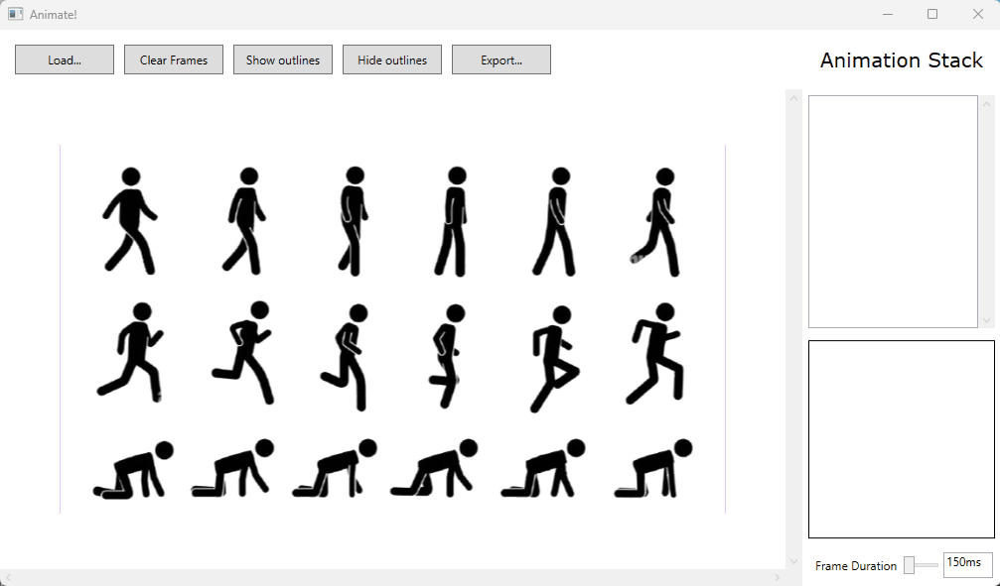

# Animate!
Animate! is a tool that allows you to animate your on-screen drawings from an image file.

Easy to use thanks to a complex interface and numerous features; the goal is to allow you to quickly visualize your animations and then export the cropped images without the background.

The UI allows you to select each area of the drawing and then adds it to the animation thread. The frame is automatically adjusted, and all file changes are detected, leaving you free to focus on drawing.

Animate! is compatible with BMP, JPG, or PNG files.

The **Export** function allows you to prepare sprites with a fixed size and without a background for importing into your development projects (e.g., Unity).

## Licence MIT

Animate! is completely royalty-free, so feel free to use it!

Want to improve the project?

​	Contact me by email at: thomas.auguey@hotmail.com
